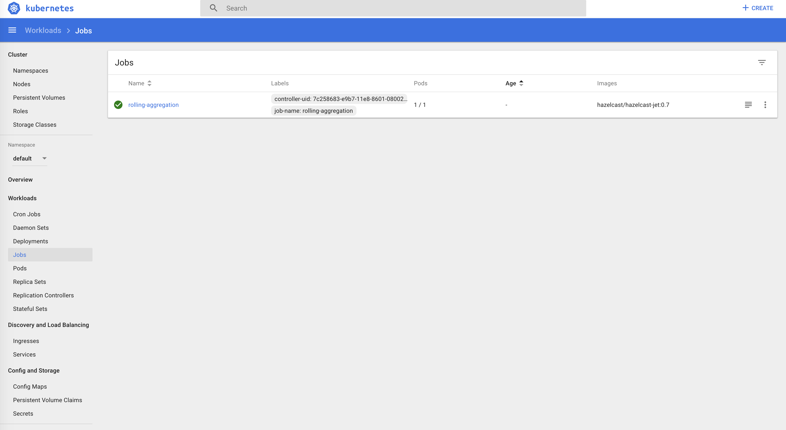
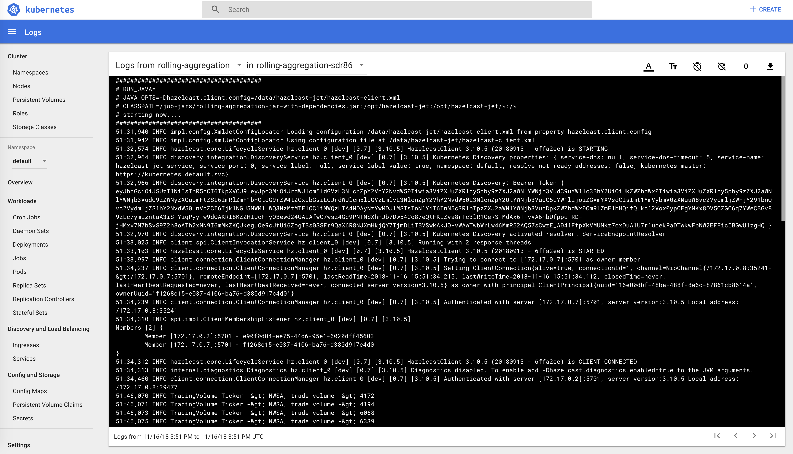
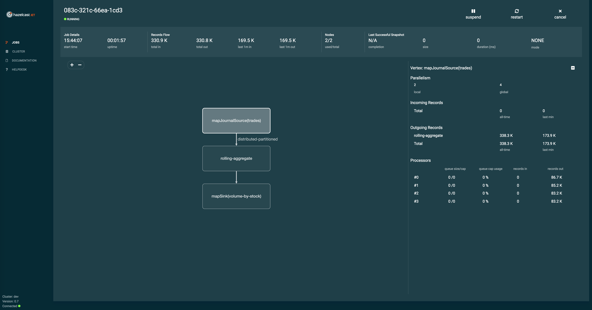

## Hazelcast Jet Kubernetes Code Sample

This sample shows how to start a Hazelcast Jet cluster, submit a sample
rolling aggregation job and inspect the cluster via Hazelcast Jet
Management Center on the Kubernetes environment.

## Prerequisites

1. A running instance of [Kubernetes](https://kubernetes.io) version 1.9
   or higher.
   * For development and testing, you may use
     [Minikube](https://kubernetes.io/docs/getting-started-guides/minikube/)
   * You must have the Kubernetes command line tool,
     [kubectl](https://kubernetes.io/docs/tasks/tools/install-kubectl/),
    installed
2. Familiarity with `kubectl`, Kubernetes, and Docker.
3. Git
4. Apache Maven
5. Java 8+

## Steps to Deploy Hazelcast Jet to Kubernetes

### 1. Create a Role Binding

Hazelcast Jet uses Kubernetes API to discover nodes and that is why you need to
grant certain permissions. The simplest Role Binding file can look as `rbac.yaml`.
Note that you can make it more specific, since Hazelcast actually uses only
certain API endpoints. Note also that if you use "DNS Lookup Discovery" instead
of "REST API Discovery", then you can skip the Role Binding step at all. Read
more at [Hazelcast Kubernetes API Plugin](https://github.com/hazelcast/hazelcast-kubernetes).

You can apply the Role Binding with the following command:

```bash
$ kubectl apply -f rbac.yaml
```

### 2. Create a Config Map

Hazelcast Jet and Hazelcast Jet Client configurations are stored in the
Config Map definition file called `hazelcast-jet-config.yaml`. You can install
it with the following command:

```bash
$ kubectl apply -f hazelcast-jet-config.yaml
```

### 3. Start a Hazelcast Jet Cluster

Finally, deploy the Hazelcast Jet cluster with the following command:

```bash
$ kubectl apply -f hazelcast-jet.yaml
```

## Run a Job on the Hazelcast Jet Cluster

There are two different ways to submit a job to a Hazelcast Jet cluster.

1. Package Job as a Docker container then let it submit itself.
2. Submit Job as a JAR file from a shared `PersistentVolume` which is attached
to a pod.


### Steps to Package the Job as a Docker Container

#### 1. Build the Job

We will use [Jib](https://github.com/GoogleContainerTools/jib/tree/master/jib-maven-plugin)
to create a Docker image for our code sample.

The code sample already has a `jib` profile which enables the configured Jib build.
Jib builds Docker and OCI images for Java applications. It is available as
plugins for Maven and Gradle and as a Java library.
You might need to add your docker registry credentials to Jib plugin
configuration section or if you'd like to use your local registry,
please update [lifecycle binding](https://github.com/GoogleContainerTools/jib/tree/master/jib-maven-plugin#bind-to-a-lifecycle)
 goal to `dockerBuild`  from `build` in the `pom.xml`.

Then, build the `rolling-aggregation` code sample with the command below:

```bash
$ mvn clean package -Pjib
```

The command above will push the image called `rolling-aggregation` to the configured
registry. If you ever changed the image name on the `jib` plugin, you need to
make sure that the name matches with the image name in the `rolling-aggregation-via-docker.yaml`

#### 2. Run the Job

Run the job with the following command:

```bash
$ kubectl apply -f rolling-aggregation-via-docker.yaml
```

Check out the inspection sections below for more details on the job.

### Steps to Submit a Job from a Shared Persistent Volume

#### 1. Build the job

Build the `rolling-aggregation` code sample with the command below:

```bash
$ mvn clean package
```

It should output the file `rolling-aggregation-jar-with-dependencies.jar` under the
`target/` folder.

Make sure that the name matches with the submitted jar name in the `rolling-aggregation.yaml`.

#### 2. Create a Persistent Volume

We will need a persistent volume attached to the pods. The persistent
storage will contains job JAR files to be submitted to the cluster.

There are many different ways you can define and map volumes in Kubernetes.
Types of volumes are discussed in the [official documentation](https://kubernetes.io/docs/concepts/storage/volumes/).

We will create `hostPath` persistent volume, which mounts a file or directory
from the host node’s filesystem into the pod.

Create a persistent volume with the following command:

```bash
$ kubectl apply -f persistent-volume.yaml
```

#### 3. Add JARs to the Persistent Storage

If you examine the `persistent-volume.yaml`, you can see the persistent volume
declaration like below;

```
kind: PersistentVolume
apiVersion: v1
metadata:
  name: rolling-aggregation-pv-volume
  labels:
    type: local
spec:
  storageClassName: manual
  capacity:
    storage: 2Gi
  accessModes:
    - ReadWriteOnce
  hostPath:
    path: "/home/docker/jars-pv"
```

The declaration will use the `/home/docker/jars-pv` directory as persistent
volume on the kubernetes node, which will be mounted to the pods later.

So we will need to place our JARs inside that directory.

Run the following commands to create persistent volume directory on minikube
and copy provided JAR file to the minikube node:

```bash
ssh docker@$(minikube ip) -i $(minikube ssh-key) 'mkdir -p ~/jars-pv'
```

Then;

```bash
scp -i $(minikube ssh-key) target/rolling-aggregation-jar-with-dependencies.jar docker@$(minikube ip):~/jars-pv/
```

#### 4. Run the Job

You can run the job with the following command:

```bash
$ kubectl apply -f rolling-aggregation.yaml
```
Check out the inspection sections below for more details on the job.

## Inspect a Jet Job with Kubernetes Dashboard

After you've run the job, you can open up Kubernetes Dashboard to see it's status.

To open Kubernetes Dashboard run the following command:

```
$ minikube dashboard
```

This will open a browser window with the Kubernetes Dashboard. Then navigate to
Jobs section on left menu.

You should be able to see your job running/completed successfully like below and
inpect the logs if you like.






## Inspect a Job with Hazelcast Jet Management Center

Hazelcast Jet Management Center enables you to monitor and manage your cluster
members running Hazelcast Jet. In addition to monitoring the overall state of
your clusters, you can also analyze and browse your jobs in detail.

You can check [Hazelcast Jet Documentation](http://docs.hazelcast.org/docs/jet/latest/manual)
and [Hazelcast Jet Management Center Documentation](https://docs.hazelcast.org/docs/jet-management-center/latest/manual/) for more information.

Starting Hazelcast Jet Management Center application consists of following steps:

- Creating a Secret with Enterprise Key
- Starting Hazelcast Jet Management Center


### Create a Secret with Enterprise Key

Hazelcast Jet Management Center requires a license key. Free trial is limited
to a single node, you can apply for a trial license key from [here](https://hazelcast.com/hazelcast-enterprise-download/).

You can store your license key as a Kubernetes Secret with the following command.

```bash
$ kubectl create secret generic management-center-license --from-literal=key=MANAGEMENT-CENTER-LICENSE-KEY-HERE
```

### Start the Hazelcast Jet Management Center

After all those prerequisites, we are ready to start Hazelcast Jet Management
Center.

You can start it with the following command:

```bash
$ kubectl apply -f hazelcast-jet-management-center.yaml
```

Then you run the following command to retrieve URL for our service :

```bash
$ minikube service hazelcast-jet-management-center --url
```

It should print out the accessible URL of the Hazelcast Jet Management Center
application like below.

```bash
$ minikube service hazelcast-jet-management-center --url
http://192.168.99.100:32272
```

Navigating to that URL should welcome you to the Hazelcast Jet Management Center.


