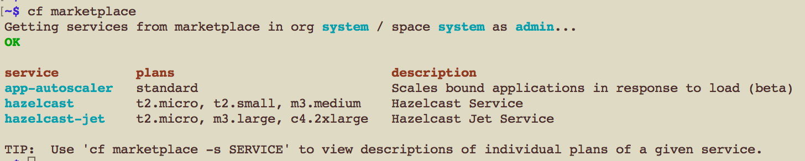

# pcf-integration

# Sample Spring Boot Application to use Hazelcast Jet for PCF

This is a sample Spring Boot application that exposes some basic Hazelcast Jet map operations like `IMap#get`, `IMap#put`
through a RESTful Web Service interface.

This application uses Hazelcast Jet Client to connect to a Hazelcast Jet cluster thats deployed on 
[Pivotal Cloud Foundry (PCF)](https://pivotal.io/platform) platform using [Hazelcast Jet for PCF](https://network.pivotal.io/).

## Creating a Hazelcast Cluster using Hazelcast Jet for PCF

1) Download Hazelcast Jet for PCF from [Pivotal Network](https://network.pivotal.io/)

2) Install Hazelcast Jet for PCF to your PCF setup. You can refer to Hazelcast Jet for PCF [documentation](https://docs.pivotal.io/hazelcast-jet-for-pcf/) for detailed installation instructions.

3) Check your Hazelcast installation using `cf marketplace` command. You should see "hazelcast-jet" as a service after installation.

   

4) Create a service `cf create-service hazelcast-jet PLAN_NAME SERVICE_NAME -c PATH_TO_hazelcast-jet.json` command. 
Hazelcast Jet for PCF accepts configuration as JSON. You can use 
[hazelcast-jet.json](hazelcast-jet.json)  provided in this project by filling the `licensekey` section with a valid license.
[hazelcast-jet.json](hazelcast-jet.json) has two additional configuration options compared to the standard Hazelcast Jet configuration.
- `instanceCount`: You can set number of desired Hazelcast Jet members using this option while creating your Hazelcast Jet service. 
Beyond that, you can change this parameter while updating your Hazelcast Jet service (using `cf update-service`) to dynamically 
scale in/out your Hazelcast cluster.
- `mancenterAppName`: This option is only meaningful when Hazelcast Management Center is enabled using below configuration.
 This has to be a unique name as this name will be registered to your PCF app domain. (i.e; http://mancenter.apps.yourpcfdomain.com)
 Note :Leave the configuration as it is if you wouldn't like to start Management Center at this point.
   ```
   ...
   "managementCenterConfig":{"enabled":true,"updateInterval":3}
   ...
   "mancenterAppName":"mancenter"
   ```
5) Check you service status using `cf services`. In our case, there are two Hazelcast Jet services available.

   

6) Build and push "pcf-integration" app using [deploy-app.sh](deploy-app.sh). This file uses [manifest.yml](manifest.yml),
you can modify it according to your needs.

   ```
   applications:
   - name: hazelcast-jet-pcf-integration
     memory: 512M
     instances: 1
     path: target/pcf-0.6.1.jar
   ```

7) Your first push attempt will fail since it needs a Hazelcast Jet service. 
Bind the Hazelcast Jet service that you've created in step 4 to your application using and restage your application;
   ```
   cf bind-service hazelcast-jet-pcf-integration SERVICE_NAME (i.e: micro-hazelcast-jet-with-mancenter)
   cf restage hazelcast-jet-pcf-integration
   ```

8) Now you can access your Hazelcast Jet Cluster deployed on PCF using this application.

   Populate `linesMap` with some lines
   ```
   http://hazelcast-jet-pcf-integration.apps.yourpcfdomain.com/populate?name=linesMap
   ```
   Do a word-count by using `linesMap` as source, results will be stored on `countsMap`
   ```
   http://hazelcast-jet-pcf-integration.apps.yourpcfdomain.com/populate?sourceName=linesMap&sinkName=countsMap
   ```
  
  


